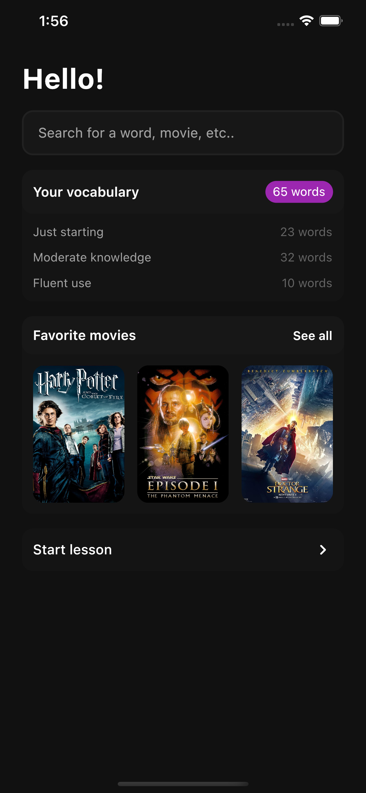

# English words learning app
This will be a fullstack app for learning english words from movies (to watch them later, maybe).

The idea for this is quite simple: users can search for movies, pick the most interesting for them and then learn the words with something like *spaced repetition*.

## Backend (Go)
For backend **microservice architecture** written with Golang will be used. The current idea assumes the following list of services:  
1. API Gateway (combines all services at once resulting in some REST API, handles user authentication with JWT and refresh tokens)
2. User service (serves user-related data such as login credentials)
3. Verification service (the service is responsible for verifying the user's actions via email by sending codes)
4. Movie service (the service serves data related to movies)
5. Dictionary service (the service provides access to the meanings of words)
6. Vocabulary service (serves user's words for learning)

For communication between services i'm going to use **gRPC** and **Apache Kafka**.

## Frontend (Flutter)
A mobile application with Flutter will play the role of a frontend for this app.

At the moment I see it mostly as a screen that scrolls down, giving you definitions of words and some challenges to test their knowledge.

Also there will be a list of movies that will represent a collection of words

For now it looks like this:

## Future growth opportunities
Implement a language-dependent API for learning words not only in English.